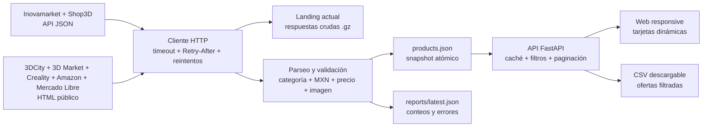

# Compara3D

Herramienta personal y proyecto académico para buscar precios de **impresoras 3D y filamentos de distintos materiales** en México. Combina APIs públicas con scraping, conserva una captura cruda comprimida de cada fuente de la ingesta general y funciona en celular, tableta y escritorio.

## Fuentes y alcance

| Fuente | Método | Datos extraídos |
| --- | --- | --- |
| [Inovamarket](https://www.inovamarket.com/) | [WooCommerce Store API pública](https://www.inovamarket.com/wp-json/wc/store/v1/products) | Impresoras, filamentos de varios materiales, precio, imagen, existencia y reseñas si existen |
| [Shop3D](https://shop3d.mx/) | WooCommerce Store API pública | Catálogo de filamentos, precio, imagen y existencia |
| [3DCity](https://www.3dcity.com.mx/) | Scraping de resultados de búsqueda | Impresoras y filamentos, precio, imagen y enlace |
| [3D Market](https://www.3dmarket.mx/) | Scraping de categorías y páginas de producto | Impresoras y filamentos, precio, imagen y enlace |
| [Creality México](https://store.creality.com/mx) | Scraping de colecciones oficiales | Impresoras y filamentos Creality, precio, imagen y enlace |
| [Amazon México](https://www.amazon.com.mx/) | Scraping de resultados públicos de búsqueda | Impresoras y filamentos, ASIN, precio, imagen y enlace |
| [Mercado Libre](https://www.mercadolibre.com.mx/) | Scraping HTTP con respaldo Selenium ante HTTP 403 | Impresoras y filamentos, precio, imagen y enlace cuando el listado permite la consulta |

Se consultan las páginas necesarias de las categorías públicas de filamentos (máximo diez por fuente). Las tiendas independientes se consultan en paralelo; las páginas de una misma tienda se consultan en secuencia con una pausa de un segundo. Todas las fuentes se muestran en MXN. Se muestran **ofertas**, no una equivalencia automática entre modelos o variantes: compara el peso, el color y los paquetes antes de elegir. Los precios pueden cambiar y no incluyen envío. Las calificaciones de la API solo se muestran cuando hay reseñas.

Amazon se consulta mediante búsquedas acotadas de impresoras y materiales comunes; puede limitar el acceso o cambiar su HTML. No se afirma existencia a partir de la página de resultados. Mercado Libre se consulta por scraping de sus listados públicos, sin token. Si responde HTTP 403, Selenium intenta leer el listado con Edge en segundo plano y espera tarjetas de producto antes de extraer título, precio, imagen y enlace. Si también muestra una página de error o verificación, la fuente figura como `blocked`, se registra el fallo y no se inventan ofertas. Si existían productos anteriores obtenidos por scraping, se conservan como datos previos. La implementación toma como referencia el flujo de navegador del [ejemplo compartido](https://github.com/ThuingWilliam/MercadoLibre), sin sus bases de datos.

3D Market indica precios **más IVA**. Para ordenar sus ofertas se muestra un estimado con la [tasa general del 16% publicada por el SAT](https://wwwmat.sat.gob.mx/articulo/19848/articulo-1); cada oferta lleva una nota visible. El total definitivo se verifica en la tienda.

## Arquitectura



La clave `id` combina tienda e identificador o slug original y evita duplicados dentro de cada fuente. El pipeline descarga la respuesta de cada fuente, guarda el contenido crudo comprimido en `data/landing/current/`, extrae las ofertas en memoria y publica `data/products.json` mediante reemplazo atómico. El reporte con conteos y errores de la ingesta general queda en `data/reports/latest.json`. La API conserva en memoria el catálogo hasta que cambia el archivo y entrega solo la página y los filtros solicitados; JavaScript construye las tarjetas en el navegador. Si falla una fuente que tenía productos, conserva sus últimas ofertas como `stale`. Una búsqueda actualizada guarda también las respuestas crudas comprimidas y agrega o reemplaza las ofertas obtenidas en `data/products.json`. La siguiente ingesta general conserva los productos encontrados por búsquedas específicas que no estén en sus listados generales. Los archivos históricos anteriores a esta arquitectura se trasladaron a `data/archive/` y la aplicación no los lee. Los datos generados se excluyen de Git.

## Ejecutar

Se requiere Python 3.11 o posterior.

```powershell
python -m venv .venv
.venv\Scripts\Activate.ps1
python -m pip install -r requirements.txt
python -c "from app.pipeline import ingest; print(ingest()['count'])"
python -m uvicorn app.server:app --host 127.0.0.1 --port 8000
```

Mercado Libre no requiere configuración de token. El respaldo Selenium necesita Microsoft Edge instalado; Selenium Manager gestiona el controlador. Su disponibilidad depende de que Mercado Libre permita leer los listados públicos desde la red donde se ejecuta el servidor. No se resuelven verificaciones de cuenta ni CAPTCHA.

Abrir `http://127.0.0.1:8000`. Para acceder desde otro dispositivo de la **misma red**, ejecutar Uvicorn con `--host 0.0.0.0` y abrir `http://<IP-del-equipo>:8000`; revisar el firewall local. El botón **Actualizar datos** inicia la ingesta general en segundo plano: la página conserva el catálogo actual y muestra cuántas tiendas han terminado. `POST /api/refresh` responde inmediatamente con HTTP 202; `GET /api/refresh/status` informa el avance y el resultado. `GET /api/products` admite `q`, `category`, `store`, `available`, `sort`, `context`, `limit` y `offset`; filtra únicamente ofertas guardadas y devuelve hasta 16 por página. `GET /api/export.csv` usa los mismos filtros y entrega todas las ofertas coincidentes del catálogo guardado, sin hacer nuevas consultas a las tiendas. El botón **Descargar CSV** aplica los filtros visibles. `GET /api/status` muestra los conteos y fallos de la última ingesta general.

La interfaz usa un solo panel con pestañas para impresoras y filamentos. El filtro de material se genera a partir de las ofertas encontradas e incluye **Todos los materiales**. Se pueden seleccionar hasta tres ofertas del mismo tipo para ver sus precios lado a lado y la diferencia frente a la más barata seleccionada.

Al abrir la página se solicita únicamente un nombre de usuario. El botón **Usuarios activos** muestra el total y abre la lista en un modal. La página avisa al servidor al entrar, ocultarse o cerrarse; los cambios se envían a las demás pestañas mediante eventos en vivo. La identidad de la pestaña se conserva al recargarla y las salidas atrasadas de una vista anterior se ignoran. Los nombres iguales se muestran una sola vez. Mientras está visible, cada pestaña confirma su presencia cada diez segundos. Si se pierde la conexión sin aviso, la presencia caduca tras 35 segundos. Es una función de presencia, no un sistema de autenticación: las sesiones se guardan en memoria y se reinician al detener el servidor.

En cada impresora se puede abrir **Ver filamentos compatibles**. La API consulta su ficha pública, extrae materiales expresamente declarados como compatibles y muestra por nombre, tienda y precio bobinas del catálogo con esos materiales. Si la ficha no los indica con claridad, no se supone compatibilidad. La coincidencia por material no sustituye la revisión de diámetro, temperatura ni requisitos especiales (por ejemplo, filamentos abrasivos). La respuesta se conserva una hora en memoria para evitar consultas repetidas.

Escribir en el buscador solo filtra `data/products.json`; no realiza solicitudes a las tiendas. Con un nombre de al menos dos caracteres aparece **Actualizar esta búsqueda**. Ese botón envía `POST /api/search/refresh` con el texto, el tipo de producto y la tienda seleccionada. Las tiendas compatibles se consultan en paralelo y cada oferta válida se guarda con su identificador estable: si ya existía, se actualizan sus datos; las demás ofertas permanecen. El catálogo conserva también el historial de búsquedas y sus fallos en la clave `searches`. Mercado Libre puede responder HTTP 403; en ese caso se registra el bloqueo y se conservan las ofertas anteriores, si las había.

## Resiliencia y validación

La API limita peticiones por IP: 20 recargas, 30 entradas de presencia, una actualización general, cuatro búsquedas actualizadas, diez CSV y doce consultas de compatibilidad por minuto. El estado de actualización permite 600 consultas por minuto para varios dispositivos de la misma red; las demás rutas API permiten 120 peticiones por minuto y ruta. Al superar un límite responde HTTP 429 con `Retry-After`; los botones de actualización muestran una cuenta regresiva, que se conserva al recargar. El aviso de salida de presencia no se limita para retirar usuarios inmediatamente. En Dokploy, Uvicorn recibe la IP del cliente a través del proxy interno.

- Solicitudes GET con timeout de conexión (5 s) y lectura (20 s).
- En la ingesta general, hasta tres reintentos para errores de conexión, lectura, HTTP 429 y HTTP 5xx, con espera exponencial y respeto de `Retry-After`. La búsqueda interactiva usa límites de tiempo más cortos para no dejar la página esperando indefinidamente.
- Pausa de un segundo entre consultas de la misma tienda en la ejecución normal. La paginación de API se limita a diez páginas por fuente.
- Fallos aislados por tienda y categoría; las demás fuentes siguen funcionando.
- Solo se publican productos con categoría reconocida, precio positivo y moneda MXN.
- Estado de cada consulta, cantidad extraída y errores en `reports/latest.json`.

Pruebas locales:

```powershell
python -m pytest -q
```

La extracción depende de la estructura y disponibilidad de los sitios externos. Si cambia el HTML o una API, hay que actualizar los selectores o el mapeo. El proyecto consulta páginas públicas con una tasa limitada y respeta las rutas de búsqueda restringidas: por ejemplo, 3D Market se consulta mediante categorías, sitemap y páginas de producto, y Creality mediante colecciones.
